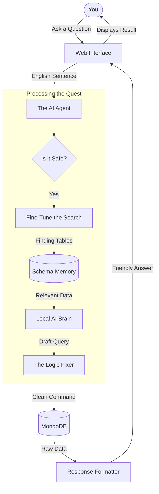

# 🗨️ The Journey of Your Quest: From Question to Answer

This report explains exactly how your AI Data Assistant turns a person's question (like *"Who spent the most last month?"*) into a clear, helpful answer from the database.

---

## 🗺️ The Big Picture: How it Works
Think of the system as a **translator** and an **expert researcher** working together.

---

## � Step-by-Step: The 5 Chapters of a Query

### 1. The Entry Point (Capture)
*   **What happens:** You type a message in the chat box.
*   **Data moving:** Your text travels from the **Web Browser** to the **Python Backend**.
*   **Goal:** To understand exactly what you are looking for.

### 2. The Identity Search (RAG)
*   **What happens:** The system transforms your question into a mathematical "vector." It then scans its **Memory** (`embeddings.pkl`) to see which database tables (like `orders` or `customers`) sound most like your question.
*   **Data moving:** Search queries go to the **Vector Memory**; relevant table names come back to the **Agent**.
*   **Goal:** To provide the AI with only the *relevant* information, so it doesn't get confused by the rest of the database.

### 3. The Local AI Brain (Reasoning)
*   **What happens:** The system sends a "Mission Brief" to your local **AI Model (Qwen2.5)**. This brief contains your question plus the specific fields from the tables found in Step 2.
*   **Data moving:** A structured prompt goes to **Ollama**; a raw computer command (code) comes back.
*   **Goal:** To turn a human request into a precise database command.

### 4. The Quality Guard (The "Fixer")
*   **What happens:** The AI sometimes makes small syntax mistakes. Our **Logic Fixer** inspects the code, fixes missing brackets, and ensures the query logic is in the right order (like making sure we "lookup" data before we filter it).
*   **Data moving:** Raw code enters the **Fixer**; a validated, safe command enters the **Database**.
*   **Goal:** To ensure the system never crashes and always returns accurate results.

### 5. The Final Delivery (Humanizing)
*   **What happens:** The database gives back a "messy" list of records. The **Formatter** picks out the most important details (names, amounts, dates) and writes them as a friendly bulleted list.
*   **Data moving:** Technical JSON data is turned into **Formatted Text**.
*   **Goal:** To make the results easy for any human to read at a glance.

---

## ⚡ Secret Superpowers of the Agent
The `mongo_chat_agent.py` file does more than just relay messages; it has built-in intelligence:

*   **🛡️ The Bodyguard:** It automatically blocks any command that tries to delete or change your data. It's read-only for absolute safety.
*   **🔄 The Auto-Mechanic:** If the AI accidentally tries to search for a custom city *before* joining the tables, the agent sees the error and swaps the blocks around automatically so the query works perfectly.
*   **🤝 The Smart Matcher:** If you ask for "Products" but your table is named "Item_Inventory," the agent uses its semantic understanding to know they are the same thing.

