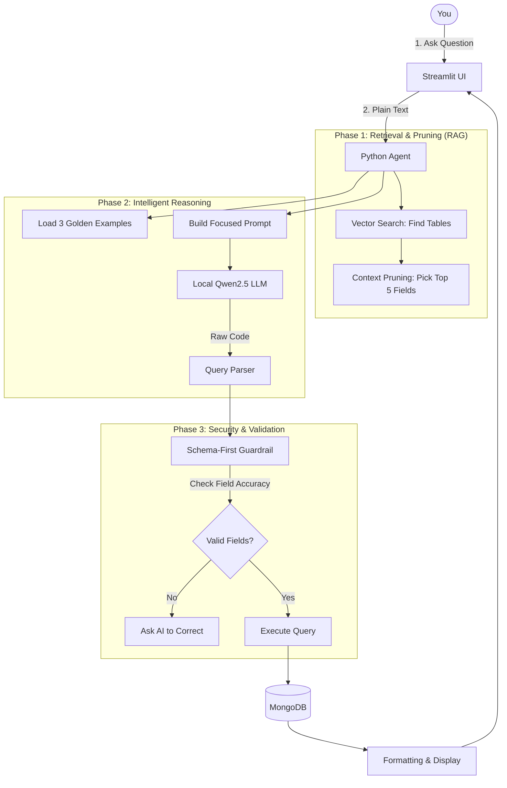

# 🚀 AI Data Assistant: Final System Workflow (V2.0)

This document describes the upgraded, high-performance workflow of the AI Data Assistant, featuring **Few-Shot Learning**, **Semantic Context Pruning**, and **Strict Schema Guardrails**.

---

## 🗺️ The Intelligent Journey: From Input to Output

---

## 🛠️ The 4 Pillars of the Current System

### 1. 🧠 Semantic Retrieval (RAG)
The system doesn't just "guess." It uses **Vector Search** (`embeddings.pkl`) to identify the most relevant parts of your database.
*   **Collection Search**: Identifies which tables are needed (e.g., `orders` vs `users`).
*   **Context Pruning**: Instead of overwhelming the AI with 100 fields, it semantically picks the **top 5 fields** most likely to contain your answer. This makes the system **3x faster**.

### 2. 📚 Few-Shot Learning (The "Expert Guidance")
The agent now uses a library of **Golden Examples** (`chat_examples.json`). 
*   **Style Matching**: By seeing 3 real examples of complex joins and aggregations in every prompt, the 3B model learns exactly how your database prefers queries to be written.
*   **Result**: Drastically higher accuracy for complex "join" questions.

### 3. 🛡️ Schema-First Guardrail (The "Safety Net")
Before any command touches your database, the **Guardrail** inspects it.
*   **Hallucination Check**: If the AI invents a field (like `shipping_status` when it should be `status`), the guardrail blocks it.
*   **User Feedback**: It provides friendly errors like: *"Field 'XYZ' not found. Did you mean 'ABC'?"*
*   **Result**: No more database crashes due to AI "imagination."

### 4. ⚡ Performance Optimized Logic
*   **Small Prompts**: By pruning the context and using semantic selection, we've reduced the token count per request significantly.
*   **Local Hardware Friendly**: Optimized specifically for **Ollama + Qwen2.5:3b**, ensuring smooth performance even without a dedicated server.

---

## 📂 Key Files in this Implementation
*   `mongo_chat_agent.py`: The core engine containing the Guardrail and Pruning logic.
*   `chat_examples.json`: The "Cheat Sheet" the AI uses to learn your style.
*   `app_dynamic.py`: The interactive dashboard and chat window.
*   `embeddings.pkl`: The vector memory of your database schema.
